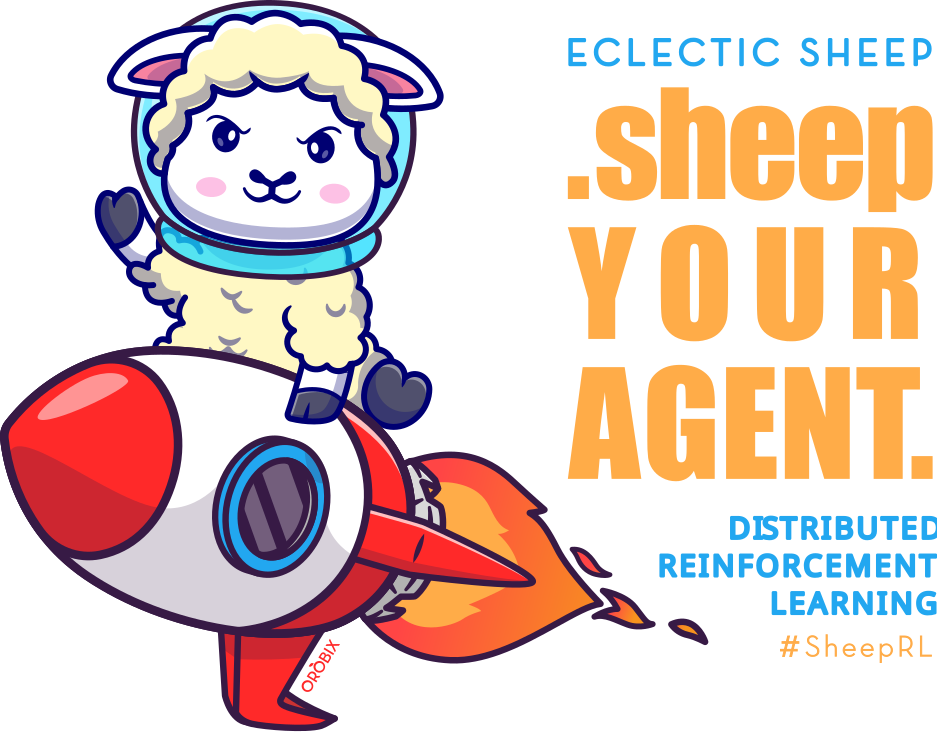
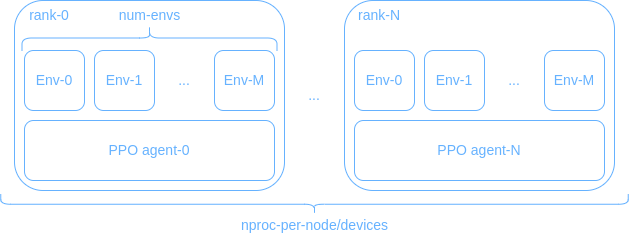

# ⚡ SheepRL 🐑

[](https://www.python.org/downloads/release/python-3100/)
[](https://www.python.org/downloads/release/python-3110/)
[](https://www.python.org/downloads/release/python-3120/)
[](https://www.python.org/downloads/release/python-3130/)

<p align="center">
  
</p>

<div align="center">
  <table>
    <tr>
      <td></td>
      <td></td>
      <td></td>
      <td></td>
    </tr>
  </table>
</div>

<div align="center">
  <table>
    <thead>
      <tr>
        <th>Environment</th>
        <th>Total frames</th>
        <th>Training time</th>
        <th>Test reward</th>
        <th>Paper reward</th>
        <th>GPUs</th>
      </tr>
    </thead>
    <tbody>
      <tr>
        <td>Crafter</td>
        <td>1M</td>
        <td>1d 3h</td>
        <td>12.1</td>
        <td>11.7</td>
        <td>1-V100</td>
      </tr>
      <tr>
        <td>Atari-MsPacman</td>
        <td>100K</td>
        <td>14h</td>
        <td>1542</td>
        <td>1327</td>
        <td>1-3080</td>
      </tr>
      <tr>
        <td> Atari-Boxing</td>
        <td>100K</td>
        <td>14h</td>
        <td>84</td>
        <td>78</td>
        <td>1-3080</td>
      </tr>
      <tr>
        <td>DOA++(w/o optimizations)<sup>1</sup></td>
        <td>7M</td>
        <td>18d 22h</td>
        <td>2726/3328<sup>2</sup></td>
        <td>N.A.</td>
        <td>1-3080</td>
      </tr>
      <tr>
        <td>Minecraft-Nav(w/o optimizations)</td>
        <td>8M</td>
        <td>16d 4h</td>
        <td>27% &gt;= 70<br>14% &gt;= 100</td>
        <td>N.A.</td>
        <td>1-V100</td>
      </tr>
    </tbody>
  </table>
</div>

1. For comparison: 1M in 2d 7h vs 1M in 1d 5h (before and after optimizations resp.)
2. Best [leaderboard score in DIAMBRA](https://diambra.ai/leaderboard) (11/7/2023)

#### Benchmarks
The training times of our implementations compared to the ones of Stable Baselines3 are shown below:

<div align="center">
  <table>
    <thead>
      <tr>
        <th colspan="2"></th>
        <th>SheepRL v0.4.0</th>
        <th>SheepRL v0.4.9</th>
        <th>SheepRL v0.5.2<br />(Numpy Buffers)</th>
        <th>SheepRL v0.5.5<br />(Numpy Buffers)</th>
        <th>StableBaselines3<sup>1</sup></th>
      </tr>
    </thead>
    <tbody>
      <tr>
        <td rowspan="2"><b>PPO</b></td>
        <td><i>1 device</i></td>
        <td>192.31s &plusmn; 1.11</td>
        <td>138.3s &plusmn; 0.16</td>
        <td>80.81s &plusmn; 0.68</td>
        <td>81.27s &plusmn; 0.47</td>
        <td>77.21s &plusmn; 0.36</td>
      </tr>
      <tr>
        <td><i>2 devices</i></td>
        <td>85.42s &plusmn; 2.27</td>
        <td>59.53s &plusmn; 0.78</td>
        <td>46.09s &plusmn; 0.59</td>
        <td>36.88s &plusmn; 0.30</td>
        <td>N.D.</td>
      </tr>
      <tr>
        <td rowspan="2"><b>A2C</b></td>
        <td><i>1 device</i></td>
        <td>N.D.</td>
        <td>N.D.</td>
        <td>N.D.</td>
        <td>84.76s &plusmn; 0.37</td>
        <td>84.22s &plusmn; 0.99</td>
      </tr>
      <tr>
        <td><i>2 devices</i></td>
        <td>N.D.</td>
        <td>N.D.</td>
        <td>N.D.</td>
        <td>28.95s &plusmn; 0.75</td>
        <td>N.D.</td>
      </tr>
      <tr>
        <td rowspan="2"><b>SAC</b></td>
        <td><i>1 device</i></td>
        <td>421.37s &plusmn; 5.27</td>
        <td>363.74s &plusmn; 3.44</td>
        <td>318.06s &plusmn; 4.46</td>
        <td>320.21 &plusmn; 6.29</td>
        <td>336.06s &plusmn; 12.26</td>
      </tr>
      <tr>
        <td><i>2 devices</i></td>
        <td>264.29s &plusmn; 1.81</td>
        <td>238.88s &plusmn; 4.97</td>
        <td>210.07s &plusmn; 27</td>
        <td>225.95 &plusmn; 3.65</td>
        <td>N.D.</td>
      </tr>
      <tr>
        <td><b>Dreamer V1</b></td>
        <td><i>1 device</i></td>
        <td>4201.23s</td>
        <td>N.D.</td>
        <td>2921.38s</td>
        <td>2207.13s</td>
        <td>N.D.</td>
      </tr>
      <tr>
        <td><b>Dreamer V2</b></td>
        <td><i>1 device</i></td>
        <td>1874.62s</td>
        <td>N.D.</td>
        <td>1148.1s</td>
        <td>906.42s</td>
        <td>N.D.</td>
      </tr>
      <tr>
        <td><b>Dreamer V3</b></td>
        <td><i>1 device</i></td>
        <td>2022.99s</td>
        <td>N.D.</td>
        <td>1378.01s</td>
        <td>1589.30s</td>
        <td>N.D.</td>
      </tr>
    </tbody>
  </table>
</div>

> [!NOTE]
>
> All experiments have been run on 4 CPUs in [Lightning Studio](https://lightning.ai/).
> All benchmarks, but the Dreamers' ones, have been run 5 times and we have taken the mean and the std of the runs. 
> We have disabled the test function, the logging, and the checkpoints. Moreover, the models were not registered using MLFlow.
> 
> Dreamers' benchmarks have been run 1 time with logging and checkpoints, without running the test function.
>
> 1. The StableBaselines3 version is `v2.2.1`, please install the package with `pip install stable-baselines3==2.2.1`

## What

An easy-to-use framework for reinforcement learning in PyTorch, accelerated with [Lightning Fabric](https://lightning.ai/docs/fabric/stable/).  
The algorithms sheeped by sheeprl out-of-the-box are:

| Algorithm                 | Recurrent          | Vector obs         | Pixel obs          | Status             |
| ------------------------- | ------------------ | ------------------ | ------------------ | ------------------ |
| A2C                       | :x:                | :heavy_check_mark: | :heavy_check_mark: | :heavy_check_mark: |
| A3C                       | :x:                | :heavy_check_mark: | :x:                | :construction:     |
| PPO                       | :x:                | :heavy_check_mark: | :heavy_check_mark: | :heavy_check_mark: |
| PPO Recurrent             | :heavy_check_mark: | :heavy_check_mark: | :heavy_check_mark: | :heavy_check_mark: |
| SAC                       | :x:                | :heavy_check_mark: | :x:                | :heavy_check_mark: |
| SAC-AE                    | :x:                | :heavy_check_mark: | :heavy_check_mark: | :heavy_check_mark: |
| DroQ                      | :x:                | :heavy_check_mark: | :x:                | :heavy_check_mark: |
| Dreamer-V1                | :heavy_check_mark: | :heavy_check_mark: | :heavy_check_mark: | :heavy_check_mark: |
| Dreamer-V2                | :heavy_check_mark: | :heavy_check_mark: | :heavy_check_mark: | :heavy_check_mark: |
| Dreamer-V3                | :heavy_check_mark: | :heavy_check_mark: | :heavy_check_mark: | :heavy_check_mark: |
| Dreamer-V3 (Nature)       | :heavy_check_mark: | :heavy_check_mark: | :heavy_check_mark: | :heavy_check_mark: |
| Plan2Explore (Dreamer V1) | :heavy_check_mark: | :heavy_check_mark: | :heavy_check_mark: | :heavy_check_mark: |
| Plan2Explore (Dreamer V2) | :heavy_check_mark: | :heavy_check_mark: | :heavy_check_mark: | :heavy_check_mark: |
| Plan2Explore (Dreamer V3) | :heavy_check_mark: | :heavy_check_mark: | :heavy_check_mark: | :heavy_check_mark: |

and more are coming soon! [Open a PR](https://github.com/Eclectic-Sheep/sheeprl/pulls) if you have any particular request :sheep:


The actions supported by sheeprl agents are:
| Algorithm                 | Continuous         | Discrete           | Multi-Discrete     |
| ------------------------- | ------------------ | ------------------ | ------------------ |
| A2C                       | :heavy_check_mark: | :heavy_check_mark: | :heavy_check_mark: |
| A3C                       | :heavy_check_mark: | :heavy_check_mark: | :heavy_check_mark: |
| PPO                       | :heavy_check_mark: | :heavy_check_mark: | :heavy_check_mark: |
| PPO Recurrent             | :heavy_check_mark: | :heavy_check_mark: | :heavy_check_mark: |
| SAC                       | :heavy_check_mark: | :x:                | :x:                |
| SAC-AE                    | :heavy_check_mark: | :x:                | :x:                |
| DroQ                      | :heavy_check_mark: | :x:                | :x:                |
| Dreamer-V1                | :heavy_check_mark: | :heavy_check_mark: | :heavy_check_mark: |
| Dreamer-V2                | :heavy_check_mark: | :heavy_check_mark: | :heavy_check_mark: |
| Dreamer-V3                | :heavy_check_mark: | :heavy_check_mark: | :heavy_check_mark: |
| Dreamer-V3 (Nature)       | :heavy_check_mark: | :heavy_check_mark: | :heavy_check_mark: |
| Plan2Explore (Dreamer V1) | :heavy_check_mark: | :heavy_check_mark: | :heavy_check_mark: |
| Plan2Explore (Dreamer V2) | :heavy_check_mark: | :heavy_check_mark: | :heavy_check_mark: |
| Plan2Explore (Dreamer V3) | :heavy_check_mark: | :heavy_check_mark: | :heavy_check_mark: |

> [!NOTE]
>
> The Dreamers and Plan2Explore play the bounded continuous actions in [-1, 1]: with `algo.normalize_actions=True` (their default), the `sheeprl.envs.wrappers.NormalizeAction` wrapper rescales them to the bounds of the action space of the environment.

The environments supported by sheeprl are:
| Environment        | Installation command         | More info                                       | Status             |
| ------------------ | ---------------------------- | ----------------------------------------------- | ------------------ |
| Classic Control    | `pip install sheeprl`           |                                                 | :heavy_check_mark: |
| Box2D              | `pip install sheeprl[box2d]`    | Please install first `swig` with `pip install swig` | :heavy_check_mark: |
| Mujoco (Gymnasium) | `pip install sheeprl[mujoco]`   | [how_to/mujoco](./howto/learn_in_dmc.md)        | :heavy_check_mark: |
| Atari              | `pip install sheeprl[atari]`    | [how_to/atari](./howto/learn_in_atari.md)       | :heavy_check_mark: |
| DeepMind Control   | `pip install sheeprl[dmc]`      | [how_to/dmc](./howto/learn_in_dmc.md)           | :heavy_check_mark: |
| MineRL             | `pip install sheeprl[minerl]`   | [how_to/minerl](./howto/learn_in_minerl.md)     | :heavy_check_mark: |
| MineDojo           | `pip install sheeprl[minedojo]` | [how_to/minedojo](./howto/learn_in_minedojo.md) | :heavy_check_mark: |
| DIAMBRA            | `pip install sheeprl[diambra]`  | [how_to/diambra](./howto/learn_in_diambra.md)   | :heavy_check_mark: |
| Crafter            | `pip install sheeprl[crafter]`  | https://github.com/danijar/crafter              | :heavy_check_mark: |
| Super Mario Bros   | `pip install sheeprl[supermario]` | https://github.com/Kautenja/gym-super-mario-bros/tree/master | :heavy_check_mark: |


## Why

We want to provide a framework for RL algorithms that is at the same time simple and scalable thanks to Lightning Fabric.

Moreover, in many RL repositories, the RL algorithm is tightly coupled with the environment, making it harder to extend them beyond the gym interface. We want to provide a framework that allows to easily decouple the RL algorithm from the environment, so that it can be used with any environment.

## How to use it

### Installation

Three options exist for installing SheepRL

1. Install the latest version directly from the [PyPi index](https://pypi.org/project/sheeprl/)
2. Clone the repo and install the local version
3. pip-install the framework using the GitHub clone URL

Instructions for the three methods are shown below.

#### Install SheepRL from PyPi


You can install the latest version of SheepRL with

```bash
pip install sheeprl
```

> [!NOTE]
> 
> To install optional dependencies one can run for example `pip install sheeprl[atari,box2d,dev,mujoco,test]`

For a detailed information about all the optional dependencies you can install please have a look at the [What](#what) section

#### Cloning and installing a local version

First, clone the repo with:

```bash
git clone https://github.com/Eclectic-Sheep/sheeprl.git
cd sheeprl
```

From inside the newly created folder run

```bash
pip install .
```

> [!NOTE]
> 
> To install optional dependencies one can run for example `pip install .[atari,box2d,dev,mujoco,test]`

#### Installing the framework from the GitHub repo

If you haven't already done so, create an environment with your choice of venv or conda.

> The example will use Python standard's venv module and assumes macOS or Linux.

```sh
# create a virtual environment
python3 -m venv .venv

# activate the environment
source .venv/bin/activate

# if you do not wish to install extras such as mujuco, atari do
pip install "sheeprl @ git+https://github.com/Eclectic-Sheep/sheeprl.git"

# or, to install with atari and mujuco environment support, do
pip install "sheeprl[atari,mujoco,dev] @ git+https://github.com/Eclectic-Sheep/sheeprl.git"

# or, to install with box2d environment support, do
pip install swig
pip install "sheeprl[box2d] @ git+https://github.com/Eclectic-Sheep/sheeprl.git"

# or, to install with minedojo environment support, do
pip install "sheeprl[minedojo,dev] @ git+https://github.com/Eclectic-Sheep/sheeprl.git"

# or, to install with minerl environment support, do
pip install "sheeprl[minerl,dev] @ git+https://github.com/Eclectic-Sheep/sheeprl.git"

# or, to install with diambra environment support, do
pip install "sheeprl[diambra,dev] @ git+https://github.com/Eclectic-Sheep/sheeprl.git"

# or, to install with super mario bros environment support, do
pip install "sheeprl[supermario,dev] @ git+https://github.com/Eclectic-Sheep/sheeprl.git"

# or, to install all extras, do
pip install swig
pip install "sheeprl[box2d,atari,mujoco,minerl,supermario,dev,test] @ git+https://github.com/Eclectic-Sheep/sheeprl.git"
```

#### Additional: installing on an M-series Mac

> [!CAUTION]
> 
> If you are on an M-series Mac and encounter an error attributed box2dpy during installation, you need to install SWIG using the instructions shown below.


It is recommended to use [homebrew](https://brew.sh/) to install [SWIG](https://formulae.brew.sh/formula/swig) to support [Gym](https://github.com/openai/gym).

```sh
# if needed install homebrew
/bin/bash -c "$(curl -fsSL https://raw.githubusercontent.com/Homebrew/install/HEAD/install.sh)"

# then, do
brew install swig

# then attempt to pip install with the preferred method, such as
pip install "sheeprl[atari,box2d,mujoco,dev,test] @ git+https://github.com/Eclectic-Sheep/sheeprl.git"
```

#### Additional: MineRL and MineDojo

> [!NOTE]
> 
> If you want to install the *minedojo* or *minerl* environment support, Java JDK 8 is required: you can install it by following the instructions at this [link](https://docs.minedojo.org/sections/getting_started/install.html#on-ubuntu-20-04).

> [!CAUTION]
>
> **MineRL** and **MineDojo** environments have **conflicting requirements**, so **DO NOT install them together** with the `pip install sheeprl[minerl,minedojo]` command, but instead **install them individually** with either the command `pip install sheeprl[minerl]` or `pip install sheeprl[minedojo]` before running an experiment with the MineRL or MineDojo environment, respectively. 

### Run an experiment with SheepRL

Now you can use one of the already available algorithms, or create your own.
For example, to train a PPO agent on the CartPole environment with only vector-like observations, just run

```bash
python sheeprl.py exp=ppo env=gym env.id=CartPole-v1
```

if you have installed from a cloned repo, or

```bash
sheeprl exp=ppo env=gym env.id=CartPole-v1
```

if you have installed SheepRL from PyPi.

Similarly, you check all the available algorithms with

```bash
python sheeprl/available_agents.py
```

if you have installed from a cloned repo, or

```bash
sheeprl-agents
```
if you have installed SheepRL from PyPi.

That's all it takes to train an agent with SheepRL! 🎉

> Before you start using the SheepRL framework, it is **highly recommended** that you read the following instructional documents:
> 
> 1. How to [run experiments](https://github.com/Eclectic-Sheep/sheeprl/blob/main/howto/run_experiments.md)
> 2. How to [modify the default configs](https://github.com/Eclectic-Sheep/sheeprl/blob/main/howto/configs.md)
> 3. How to [work with steps](https://github.com/Eclectic-Sheep/sheeprl/blob/main/howto/work_with_steps.md)
> 4. How to [select observations](https://github.com/Eclectic-Sheep/sheeprl/blob/main/howto/select_observations.md)
>
> Moreover, there are other useful documents in the [`howto` folder](https://github.com/Eclectic-Sheep/sheeprl/tree/main/howto), these documents contain some guidance on how to properly use the framework.

### :chart_with_upwards_trend: Check your results

Once you trained an agent, a new folder called `logs` will be created, containing the logs of the training. You can visualize them with [TensorBoard](https://www.tensorflow.org/tensorboard):

```bash
tensorboard --logdir logs
```

https://github.com/Eclectic-Sheep/sheeprl/assets/7341604/46ad4acd-180d-449d-b46a-25b4a1f038d9

### :nerd_face: More about running an algorithm

What you run is the PPO algorithm with the default configuration. But you can also change the configuration by passing arguments to the script.

For example, in the default configuration, the number of parallel environments is 4. Let's try to change it to 8 by passing the `env.num_envs` argument:

```bash
sheeprl exp=ppo env=gym env.id=CartPole-v1 env.num_envs=8
```

All the available arguments, with their descriptions, are listed in the `sheeprl/configs` directory. You can find more information about the hierarchy of configs [here](./howto/configs.md).

### Running with Lightning Fabric

To run the algorithm with Lightning Fabric, you need to specify the Fabric parameters through the CLI. For example, to run the PPO algorithm on 2 processes on the CPU, each with 4 parallel environments, you can run:

```bash
sheeprl fabric.accelerator=cpu fabric.strategy=ddp fabric.devices=2 exp=ppo env=gym env.id=CartPole-v1
```

Every process plays in its own environments and trains its own copy of the agent: the processes start from the same weights, and the gradients are averaged over the processes at every optimizer step.

You can check the available parameters for Lightning Fabric [here](https://lightning.ai/docs/fabric/stable/api/fabric_args.html).

### Evaluate your Agents

You can easily evaluate your trained agents from checkpoints: training configurations are retrieved automatically.

```bash
sheeprl-eval checkpoint_path=/path/to/checkpoint.ckpt fabric.accelerator=gpu env.capture_video=True
```

For more information, check the corresponding [howto](./howto/eval_your_agent.md).

## :book: Repository structure

The repository is structured as follows:

- `algos`: contains the implementations of the algorithms. Each algorithm is in a separate folder, and (possibly) contains the following files:

  - `<algorithm>.py`: contains the implementation of the algorithm.
  - `agent`: optional, contains the implementation of the agent.
  - `loss.py`: contains the implementation of the loss functions of the algorithm.
  - `utils.py`: contains utility functions for the algorithm.
  - `evaluate.py`: contains the evaluation function of the algorithm, used by `sheeprl-eval`.
- `configs`: contains the default configs of the algorithms.
- `core`: contains the training loop shared by all the algorithms, and the interface that every algorithm implements.
- `data`: contains the implementation of the data buffers.
- `envs`: contains the implementation of the environment wrappers.
- `models`: contains the implementation of some standard models (building blocks), like the multi-layer perceptron (MLP) or a simple convolutional network (NatureCNN)
- `utils`: contains utility functions for the framework.

## :gear: How SheepRL works

### From the command line to the algorithm

```bash
sheeprl exp=ppo env=gym env.id=CartPole-v1 algo.total_steps=100000
```

1. [Hydra](https://hydra.cc) composes the configuration from `sheeprl/configs`: the `exp` file chooses the groups (`algo`, `env`, `buffer`, `fabric`, `metric`, `checkpoint`, ...) and overrides some of their keys, and every key can be overridden from the command line.
2. `sheeprl.cli.run` checks the configuration, creates the [Lightning Fabric](https://lightning.ai/docs/fabric/stable/) of the run (`fabric.accelerator`, `fabric.devices`, `fabric.strategy`, `fabric.precision`), starts one process per device and seeds them.
3. Every process calls the `main()` of the algorithm named by `algo.name`, registered with the `@register_algorithm()` decorator. `main()` creates the algorithm and hands it to the training loop shared by every algorithm, `sheeprl.core.run`; when the training ends, it tests the agent (`algo.run_test=True`) and registers its models (`model_manager.disabled=False`).

### The training loop

Every process has its own environments and its own copy of the agent, which interacts with the environments and executes the training loop.

<p align="center">
  
</p>

Every iteration of `sheeprl.core.run(fabric, cfg, algo)`:

1. **plays**: the player of the algorithm chooses the actions for the current observations and steps the environments (`EnvRunner`) `algo.steps_per_iteration` times, writing every step in the *store* of the collected data: the rollout of the on-policy algorithms, the replay buffer of the off-policy ones;
2. **trains**: `algo.batches()` yields one batch per gradient step and `algo.train_step()` does the step, returning its metrics. The on-policy algorithms train on their rollout (epochs × minibatches); the off-policy ones start after `algo.learning_starts` policy steps (optionally with `algo.per_rank_pretrain_steps` gradient steps first) and then do `algo.replay_ratio` gradient steps per policy step (`TrainSchedule`);
3. **logs and saves**: the metrics are aggregated on the device and read on the host once every `metric.log_every` policy steps, and a checkpoint is saved every `checkpoint.every` policy steps (`Cadence`).

### The interface of an algorithm

An algorithm is implemented in its `<algorithm>.py` file, as a subclass of `sheeprl.core.Algorithm` with the following methods:

- `build()`: creates the training state (modules, optimizers, ...) and the store of the collected data, a `ReplayStore` (a `ReplayBuffer` and its sampler): a `Rollout`, whose `EpochSampler` draws the minibatches of an update, for the on-policy algorithms.
- `player()`: returns the object that plays the current policy in the environments and writes what happens in the store.
- `batches()`: prepares the training data of an iteration and yields one batch per gradient step.
- `train_step()`: executes one gradient step on a batch and returns the metrics to log, as tensors.
- `end_iteration()`: optional, updates what changes once per iteration (e.g. annealed coefficients).
- `test()`: plays a test episode with the trained policy, at the end of the training and to evaluate a checkpoint.

Its class attributes tell the loop how to drive it: `steps_per_iteration` (e.g. the rollout length of the on-policy algorithms, 1 for the off-policy ones), `off_policy` (training on a replay buffer, with the learning starts and the replay ratio above) and `restart_crashed_envs` (a crashed environment is created again instead of stopping the run).

Every algorithm of SheepRL (A2C, PPO, PPO Recurrent, SAC, DroQ, SAC-AE, DreamerV1, DreamerV2, DreamerV3, DreamerV3.5 and the exploration and finetuning of Plan2Explore) is implemented this way: the environments, the logging, the checkpoints and the resuming of a run are the same for all of them.

### Distributed training

The modules are not wrapped by `DistributedDataParallel`: every process computes the gradients on its own data, and `update` (`sheeprl.core.update`) averages them over the processes before every optimizer step. The processes start from the same weights, so they stay identical. Every process samples its own replay buffer, and the processes of an on-policy algorithm do the same number of gradient steps, even with rollouts split into different numbers of minibatches.

### Compiling the losses

With `algo.compile.enabled=True`, the losses of the algorithm (forward and backward passes) are compiled with `torch.compile`, also with several processes. With `algo.compile.mode=reduce-overhead` (the default), the compiled losses run as CUDA graphs in the `32-true` and `bf16-mixed` precisions (the other precisions use the default mode), which removes most of the cost of launching their many small kernels. The players and the optimizer steps are not compiled.

The losses are written so that they compile into graphs that don't wait for the GPU: they don't read tensors on the host (`.item()`, an `if` on a tensor), their shapes don't depend on the data (e.g. masked sums instead of boolean indexing, and the minibatches of PPO Recurrent padded to a few sizes), and the recurrent layers are unrolled from their weights while compiling, since `torch.compile` doesn't trace `nn.LSTM` and `nn.GRU`.

Compiling takes from a few seconds (PPO, SAC) to a few minutes (the Dreamers) at the start of the run. Then, on an RTX 5070 in `32-true`, a gradient step of the default experiments is from about 1.2× (PPO on Atari and SAC-AE, on pixels) and 1.4-1.9× (the Dreamers) to 2.8× (PPO on CartPole) faster. CUDA graphs reserve more memory: when a large model doesn't fit, `algo.compile.mode=null` compiles without them.

### Checkpoints, resuming and evaluation

The training state is a `TrainState` dataclass: each of its fields (modules, optimizers, annealed coefficients, ...) is saved in the checkpoints and restored when a run is resumed. The evaluation (`sheeprl-eval`) and the registration of the models from a checkpoint (`sheeprl-registration`) restore it in the same way, with `sheeprl.core.load_trained_state`.

A resumed run starts from the iteration after the one of its checkpoint. The replay buffer of an off-policy run is saved in the checkpoints when `buffer.checkpoint=True`: a run resumed with it trains right away, without playing random actions again; without it, it first fills a new one, playing its policy for `algo.learning_starts` policy steps.

## Algorithms implementation

You can check inside the folder of each algorithm the `README.md` file for the details about the implementation.

All algorithms are kept as simple as possible, in a [CleanRL](https://github.com/vwxyzjn/cleanrl) fashion. But to allow for more flexibility and also more clarity, we tried to abstract away anything that is not strictly related to the algorithm: the environments, the logging, the checkpoints and the resuming of a run are handled by the shared training loop, and the `core` folder also provides the helpers for the device, the precision and the optimizer steps (`setup_module`, `autocast` and `update`).

For example, we decided to create a `models` folder with already-made models that can be composed to create the model of the agent.

For each algorithm, losses are kept in a separate module, so that their implementation is clear and can be easily utilized for the recurrent version of the algorithm.

## :card_index_dividers: Buffer

For the buffer implementation, we choose to use a wrapper around a dictionary of Numpy arrays.

To enable a simple way to work with numpy memory-mapped arrays, we implemented the `sheeprl.utils.memmap.MemmapArray`, a container that handles the memory-mapped arrays.

Every algorithm stores its steps in a single kind of storage, the `ReplayBuffer`: the steps of every environment, with a write pointer per environment (`add` with `env_idxes` writes some environments only, e.g. the first steps of the ones that ended an episode). What the training reads from it is decided by the samplers of `sheeprl.data.samplers`, which draw the steps of the samples with their own random number generator and let the buffer gather them:

- `TransitionSampler`: single steps (SAC, DroQ, SAC-AE);
- `SequenceSampler`: sequences of consecutive steps of a single environment (the Dreamers, Plan2Explore);
- `EpisodeSampler`: sequences inside the episodes that ended, with their ends prioritized with `buffer.prioritize_ends` (DreamerV2 with `buffer.type=episode`);
- `EpochSampler`: the minibatches of the epochs of an on-policy update (PPO, A2C, PPO-recurrent).

The classes `SequentialReplayBuffer`, `EnvIndependentReplayBuffer` and `EpisodeBuffer` are kept for their `sample` methods and for the checkpoints of the previous versions, which are converted to the single storage when they are loaded.

The off-policy algorithms train on a `sheeprl.data.store.ReplayStore`: a storage and a sampler, whose batches go to the device of the training. The store is saved in the checkpoints with its sampler, whose generator a resumed run continues. With `buffer.prefetch` the next batches are sampled in a thread while the training uses the current ones, and with `buffer.on_device` the storage is kept in the memory of the device, where its batches are gathered (see the [configs howto](./howto/configs.md#buffer)).

### :mag: Technical details

The shape of the Numpy arrays in the dictionary is `(T, B, *)`, where `T` is the number of timesteps, `B` is the number of parallel environments, and `*` is the shape of the data.

The on-policy algorithms (A2C, PPO and PPO Recurrent) store their rollout in a `ReplayBuffer` with `T` equal to `algo.rollout_steps` and `B` equal to `env.num_envs`, wrapped in a `sheeprl.core.Rollout`. For A2C and PPO, `buffer.size` must be equal to `algo.rollout_steps`.

## :bow: Contributing

The best way to contribute is by opening an issue to discuss a new feature or a bug, or by opening a PR to fix a bug or to add a new feature.

## :mailbox_with_no_mail: Contacts

You can contact us for any further questions or discussions:

- Federico Belotti: belo.fede@outlook.com
- Davide Angioni: davide.angioni@orobix.com
- Refik Can Malli: refikcan.malli@orobix.com
- Michele Milesi: michele.milesi@orobix.com
