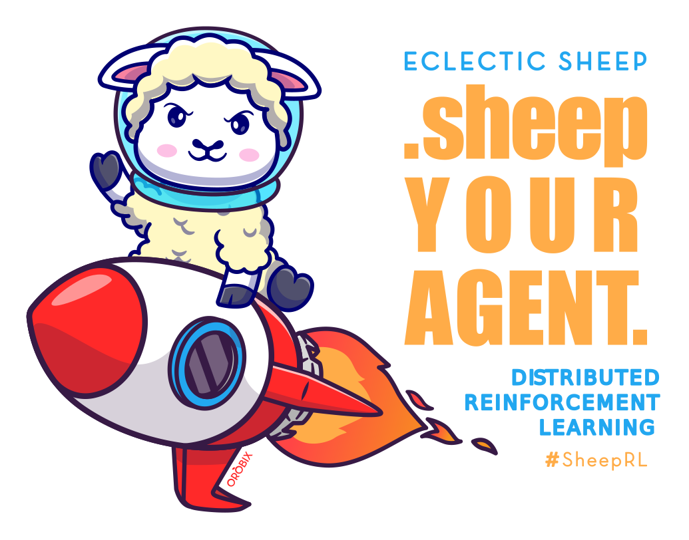
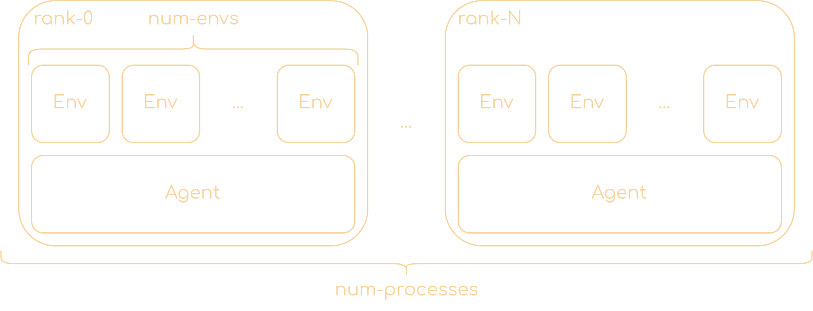

# ⚡ SheepRL 🐑

<p align="center">
  
</p>

<div align="center">
  <table>
    <tr>
      <td></td>
      <td></td>
      <td></td>
      <td></td>
    </tr>
  </table>
</div>

<div align="center">
  <table>
<thead>
  <tr>
    <th>Environment</th>
    <th>Total frames</th>
    <th>Training time</th>
    <th>Test reward</th>
    <th>Paper reward</th>
    <th>GPUs</th>
  </tr>
</thead>
<tbody>
  <tr>
    <td>Crafter</td>
    <td>1M</td>
    <td>1d 3h</td>
    <td>12.1</td>
    <td>11.7</td>
    <td>1-V100</td>
  </tr>
  <tr>
    <td>Atari-MsPacman</td>
    <td>100K</td>
    <td>14h</td>
    <td>1542</td>
    <td>1327</td>
    <td>1-3080</td>
  </tr>
  <tr>
    <td> Atari-Boxing</td>
    <td>100K</td>
    <td>14h</td>
    <td>84</td>
    <td>78</td>
    <td>1-3080</td>
  </tr>
  <tr>
    <td>DOA++(w/o optimizations)<sup>1</sup></td>
    <td>7M</td>
    <td>18d 22h</td>
    <td>2726/3328<sup>2</sup></td>
    <td>N.A.</td>
    <td>1-3080</td>
  </tr>
  <tr>
    <td>Minecraft-Nav(w/o optimizations)</td>
    <td>8M</td>
    <td>16d 4h</td>
    <td>27% &gt;= 70<br>14% &gt;= 100</td>
    <td>N.A.</td>
    <td>1-V100</td>
  </tr>
</tbody>
</table>
</div>

1. For comparison: 1M in 2d 7h vs 1M in 1d 15h (before and after optimizations resp.)
2. Best [leaderboard score in DIAMBRA](https://diambra.ai/leaderboard) (11/7/2023)

## What

An easy-to-use framework for reinforcement learning in PyTorch, accelerated with [Lightning Fabric](https://lightning.ai/docs/fabric/stable/).  
The algorithms sheeped by sheeprl out-of-the-box are:

| Algorithm                 | Coupled            | Decoupled          | Recurrent          | Vector obs         | Pixel obs          | Status             |
| ------------------------- | ------------------ | ------------------ | ------------------ | ------------------ | ------------------ | ------------------ |
| A2C                       | :heavy_check_mark: | :heavy_check_mark: | :heavy_check_mark: | :heavy_check_mark: | :heavy_check_mark: | :construction:     |
| A3C                       | :heavy_check_mark: | :x:                | :x:                | :heavy_check_mark: | :heavy_check_mark: | :construction:     |
| PPO                       | :heavy_check_mark: | :heavy_check_mark: | :x:                | :heavy_check_mark: | :heavy_check_mark: | :heavy_check_mark: |
| PPO Recurrent             | :heavy_check_mark: | :x:                | :heavy_check_mark: | :heavy_check_mark: | :heavy_check_mark: | :heavy_check_mark: |
| SAC                       | :heavy_check_mark: | :heavy_check_mark: | :x:                | :heavy_check_mark: | :x:                | :heavy_check_mark: |
| SAC-AE                    | :heavy_check_mark: | :x:                | :x:                | :heavy_check_mark: | :heavy_check_mark: | :heavy_check_mark: |
| DroQ                      | :heavy_check_mark: | :x:                | :x:                | :heavy_check_mark: | :x:                | :heavy_check_mark: |
| Dreamer-V1                | :heavy_check_mark: | :x:                | :heavy_check_mark: | :heavy_check_mark: | :heavy_check_mark: | :heavy_check_mark: |
| Dreamer-V2                | :heavy_check_mark: | :x:                | :heavy_check_mark: | :heavy_check_mark: | :heavy_check_mark: | :heavy_check_mark: |
| Dreamer-V3                | :heavy_check_mark: | :x:                | :heavy_check_mark: | :heavy_check_mark: | :heavy_check_mark: | :heavy_check_mark: |
| Plan2Explore (Dreamer V1) | :heavy_check_mark: | :x:                | :heavy_check_mark: | :heavy_check_mark: | :heavy_check_mark: | :heavy_check_mark: |
| Plan2Explore (Dreamer V2) | :heavy_check_mark: | :x:                | :heavy_check_mark: | :heavy_check_mark: | :heavy_check_mark: | :heavy_check_mark: |
| Plan2Explore (Dreamer V3) | :heavy_check_mark: | :x:                | :heavy_check_mark: | :heavy_check_mark: | :heavy_check_mark: | :heavy_check_mark: |

and more are coming soon! [Open a PR](https://github.com/Eclectic-Sheep/sheeprl/pulls) if you have any particular request :sheep:


The actions supported by sheeprl agents are:
| Algorithm                 | Continuous         | Discrete           | Multi-Discrete     |
| ------------------------- | ------------------ | ------------------ | ------------------ |
| A2C                       | :heavy_check_mark: | :heavy_check_mark: | :heavy_check_mark: |
| A3C                       | :heavy_check_mark: | :heavy_check_mark: | :heavy_check_mark: |
| PPO                       | :heavy_check_mark: | :heavy_check_mark: | :heavy_check_mark: |
| PPO Recurrent             | :heavy_check_mark: | :heavy_check_mark: | :heavy_check_mark: |
| SAC                       | :heavy_check_mark: | :x:                | :x:                |
| SAC-AE                    | :heavy_check_mark: | :x:                | :x:                |
| DroQ                      | :heavy_check_mark: | :x:                | :x:                |
| Dreamer-V1                | :heavy_check_mark: | :heavy_check_mark: | :heavy_check_mark: |
| Dreamer-V2                | :heavy_check_mark: | :heavy_check_mark: | :heavy_check_mark: |
| Dreamer-V3                | :heavy_check_mark: | :heavy_check_mark: | :heavy_check_mark: |
| Plan2Explore (Dreamer V1) | :heavy_check_mark: | :heavy_check_mark: | :heavy_check_mark: |
| Plan2Explore (Dreamer V2) | :heavy_check_mark: | :heavy_check_mark: | :heavy_check_mark: |
| Plan2Explore (Dreamer V3) | :heavy_check_mark: | :heavy_check_mark: | :heavy_check_mark: |

The environments supported by sheeprl are:
| Algorithm          | Installation command         | More info                                       | Status             |
| ------------------ | ---------------------------- | ----------------------------------------------- | ------------------ |
| Classic Control    | `pip install -e .`           |                                                 | :heavy_check_mark: |
| Box2D              | `pip install -e .`           |                                                 | :heavy_check_mark: |
| Mujoco (Gymnasium) | `pip install -e .`           | [how_to/mujoco](./howto/learn_in_dmc.md)        | :heavy_check_mark: |
| Atari              | `pip install -e .[atari]`    | [how_to/atari](./howto/learn_in_atari.md)       | :heavy_check_mark: |
| DeepMind Control   | `pip install -e .[dmc]`      | [how_to/dmc](./howto/learn_in_dmc.md)           | :heavy_check_mark: |
| MineRL             | `pip install -e .[minerl]`   | [how_to/minerl](./howto/learn_in_minerl.md)     | :heavy_check_mark: |
| MineDojo           | `pip install -e .[minedojo]` | [how_to/minedojo](./howto/learn_in_minedojo.md) | :heavy_check_mark: |
| DIAMBRA            | `pip install -e .[diambra]`  | [how_to/diambra](./howto/learn_in_diambra.md)   | :heavy_check_mark: |
| Crafter            | `pip install -e .[crafter]`  | https://github.com/danijar/crafter              | :heavy_check_mark: |


## Why

We want to provide a framework for RL algorithms that is at the same time simple and scalable thanks to Lightning Fabric.

Moreover, in many RL repositories, the RL algorithm is tightly coupled with the environment, making it harder to extend them beyond the gym interface. We want to provide a framework that allows to easily decouple the RL algorithm from the environment, so that it can be used with any environment.

## How to use

Two options exist for using SheepRL. One can either clone the repo and install the local version, or one can pip install the framework using the GitHub clone URL. Instructions for both methods are shown below.

<details>
  <summary>Cloning and installing a local version</summary>

First, clone the repo with:

```bash
git clone https://github.com/Eclectic-Sheep/sheeprl.git
cd sheeprl
```

From inside the newly created folder run

```bash
pip install .
```

> **Note**
>
> To install all the optional dependencies one can run `pip install .[atari,mujoco,dev,test]`

</details>

<details>
  <summary>Installing the framework from the GitHub repo</summary>

If you haven't already done so, create an environment with your choice of venv or conda.

> **Note**
>
> The example will use Python standard's venv module and assumes macOS or Linux.

```sh
# create a virtual environment
python3 -m venv .venv
# activate the environment
source .venv/bin/activate
# if you do not wish to install extras such as mujuco, atari do
pip install "sheeprl @ git+https://github.com/Eclectic-Sheep/sheeprl.git"
# or, to install with atari and mujuco environment support, do
pip install "sheeprl[atari,mujoco,dev]  @ git+https://github.com/Eclectic-Sheep/sheeprl.git"
# or, to install with box2d environment support, do
pip install swig
pip install "sheeprl[box2d]  @ git+https://github.com/Eclectic-Sheep/sheeprl.git"
# or, to install with minedojo environment support, do
pip install "sheeprl[minedojo,dev]  @ git+https://github.com/Eclectic-Sheep/sheeprl.git"
# or, to install with minerl environment support, do
pip install "sheeprl[minerl,dev]  @ git+https://github.com/Eclectic-Sheep/sheeprl.git"
# or, to install with diambra environment support, do
pip install "sheeprl[diambra,dev]  @ git+https://github.com/Eclectic-Sheep/sheeprl.git"
# or, to install all extras, do
pip install "sheeprl[atari,mujoco,miedojo,dev,test]  @ git+https://github.com/Eclectic-Sheep/sheeprl.git"
```

</details>

<details>
  <summary>Installing on an M-series Mac</summary>

> **Note**
>
> If you are on an M-series Mac and encounter an error attributed box2dpy during installation, you need to install SWIG using the instructions shown below.


It is recommended to use [homebrew](https://brew.sh/) to install [SWIG](https://formulae.brew.sh/formula/swig) to support [Gym](https://github.com/openai/gym).

```sh
# if needed install homebrew
/bin/bash -c "$(curl -fsSL https://raw.githubusercontent.com/Homebrew/install/HEAD/install.sh)"
# then, do
brew install swig
# then attempt to pip install with the preferred method, such as
pip install "sheeprl[atari,box2d,mujoco,dev,test] @ git+https://github.com/Eclectic-Sheep/sheeprl.git"
```

</details>

<details>
  <summary>MineRL, MineDojo and DIAMBRA</summary>

> **Note**
>
> If you want to install the *minedojo* or *minerl* environment support, Java JDK 8 is required: you can install it by following the instructions at this [link](https://docs.minedojo.org/sections/getting_started/install.html#on-ubuntu-20-04).
>
> **MineRL** and **MineDojo** environments have **conflicting requirements**, so **DO NOT install them together** with the `pip install -e .[minerl,minedojo]` command, but instead **install them individually** with either the command `pip install -e .[minerl]` or `pip install -e .[minedojo]` before running an experiment with the MineRL or MineDojo environment, respectively.

</details>  

Now you can use one of the already available algorithms, or create your own.

For example, to train a PPO agent on the CartPole environment with only vector-like observations, just run

```bash
python sheeprl.py exp=ppo env=gym env.id=CartPole-v1
```

You check all the available algorithms with

```bash
python sheeprl/available_agents.py
```

That's all it takes to train an agent with SheepRL! 🎉

> **Note**
>
> Before you start using the SheepRL framework, it is **highly recommended** that you read the following instructional documents:
> 
> 1. How to [run experiments](https://github.com/Eclectic-Sheep/sheeprl/blob/main/howto/run_experiments.md)
> 2. How to [modify the default configs](https://github.com/Eclectic-Sheep/sheeprl/blob/main/howto/configs.md)
> 3. How to [work with steps](https://github.com/Eclectic-Sheep/sheeprl/blob/main/howto/work_with_steps.md)
> 4. How to [select observations](https://github.com/Eclectic-Sheep/sheeprl/blob/main/howto/select_observations.md)
>
> Moreover, there are other useful documents in the [`howto` folder](https://github.com/Eclectic-Sheep/sheeprl/tree/main/howto), these documents contain some guidance on how to properly use the framework.

### :chart_with_upwards_trend: Check your results

Once you trained an agent, a new folder called `logs` will be created, containing the logs of the training. You can visualize them with [TensorBoard](https://www.tensorflow.org/tensorboard):

```bash
tensorboard --logdir logs
```

https://github.com/Eclectic-Sheep/sheeprl/assets/7341604/46ad4acd-180d-449d-b46a-25b4a1f038d9

### :nerd_face: More about running an algorithm

What you run is the PPO algorithm with the default configuration. But you can also change the configuration by passing arguments to the script.

For example, in the default configuration, the number of parallel environments is 4. Let's try to change it to 8 by passing the `--num_envs` argument:

```bash
python sheeprl.py exp=ppo env=gym env.id=CartPole-v1 env.num_envs=8
```

All the available arguments, with their descriptions, are listed in the `sheeprl/config` directory. You can find more information about the hierarchy of configs [here](./howto/run_experiments.md).

### Running with Lightning Fabric

To run the algorithm with Lightning Fabric, you need to specify the Fabric parameters through the CLI. For example, to run the PPO algorithm with 4 parallel environments on 2 nodes, you can run:

```bash
python sheeprl.py fabric.accelerator=cpu fabric.strategy=ddp fabric.devices=2 exp=ppo env=gym env.id=CartPole-v1
```

You can check the available parameters for Lightning Fabric [here](https://lightning.ai/docs/fabric/stable/api/fabric_args.html).

### Evaluate your Agents

You can easily evaluate your trained agents from checkpoints: training configurations are retrieved automatically.

```bash
python sheeprl_eval.py checkpoint_path=/path/to/checkpoint.ckpt fabric.accelerator=gpu env.capture_video=True
```

For more information, check the corresponding [howto](./howto/eval_your_agent.md).

## :book: Repository structure

The repository is structured as follows:

- `algos`: contains the implementations of the algorithms. Each algorithm is in a separate folder, and (possibly) contains the following files:

  - `<algorithm>.py`: contains the implementation of the algorithm.
  - `<algorithm>_decoupled.py`: contains the implementation of the decoupled version of the algorithm, if present.
  - `agent`: optional, contains the implementation of the agent.
  - `loss.py`: contains the implementation of the loss functions of the algorithm.
  - `utils.py`: contains utility functions for the algorithm.
- `configs`: contains the default configs of the algorithms.
- `data`: contains the implementation of the data buffers.
- `envs`: contains the implementation of the environment wrappers.
- `models`: contains the implementation of some standard models (building blocks), like the multi-layer perceptron (MLP) or a simple convolutional network (NatureCNN)
- `utils`: contains utility functions for the framework.

#### Coupled vs Decoupled

In the coupled version of an algorithm, the agent interacts with the environment and executes the training loop.

<p align="center">
  
</p>

In the decoupled version, a process is responsible only for interacting with the environment, and all the other processes are responsible for executing the training loop. The two processes communicate through [distributed collectives, adopting the abstraction provided by Fabric's TorchCollective](https://lightning.ai/docs/fabric/stable/api/generated/lightning.fabric.plugins.collectives.TorchCollective.html#lightning.fabric.plugins.collectives.TorchCollective).

<p align="center">
  
</p>

#### Coupled

The algorithm is implemented in the `<algorithm>.py` file.

There are 2 functions inside this script:

- `main()`: initializes all the components of the algorithm, and executes the interactions with the environment. Once enough data is collected, the training loop is executed by calling the `train()` function.
- `train()`: executes the training loop. It samples a batch of data from the buffer, computes the loss, and updates the parameters of the agent.

#### Decoupled

The decoupled version of an algorithm is implemented in the `<algorithm>_decoupled.py` file.

There are 3 functions inside this script:

- `main()`: initializes all the components of the algorithm, the collectives for the communication between the player and the trainers, and calls the `player()` and `trainer()` functions.
- `player()`: executes the interactions with the environment. It samples an action from the policy network, executes it in the environment, and stores the transition in the buffer. After a predefined number of interactions with the environment, the player randomly splits the collected data into almost equal chunks and sends them separately to the trainers. It then waits for the trainers to finish the agent update.
- `trainer()`: executes the training loop. It receives a chunk of data from the player, computes the loss, and updates the parameters of the agent. After the agent has been updated, the first of the trainers sends back the updated agent weights to the player, which can interact again with the environment.

## Algorithms implementation

You can check inside the folder of each algorithm the `README.md` file for the details about the implementation.

All algorithms are kept as simple as possible, in a [CleanRL](https://github.com/vwxyzjn/cleanrl) fashion. But to allow for more flexibility and also more clarity, we tried to abstract away anything that is not strictly related to the training loop of the algorithm.

For example, we decided to create a `models` folder with already-made models that can be composed to create the model of the agent.

For each algorithm, losses are kept in a separate module, so that their implementation is clear and can be easily utilized for the decoupled or the recurrent version of the algorithm.

## :card_index_dividers: Buffer

For the buffer implementation, we choose to use a wrapper around a [TensorDict](https://pytorch.org/rl/tensordict/reference/generated/tensordict.TensorDict.html).

TensorDict comes in handy since we can easily add custom fields to the buffer as if we are working with dictionaries, but we can also easily perform operations on them as if we are working with tensors.

This flexibility makes it very simple to implement, with the classes `ReplayBuffer`, `SequentialReplayBuffer`, `EpisodeBuffer`, and `AsyncReplayBuffer`, all the buffers needed for on-policy and off-policy algorithms.

### :mag: Technical details

The tensor's shape in the TensorDict is `(T, B, *)`, where `T` is the number of timesteps, `B` is the number of parallel environments, and `*` is the shape of the data.

For the `ReplayBuffer` to be used as a RolloutBuffer, the proper `buffer_size` must be specified. For example, for PPO, the `buffer_size` must be `[T, B]`, where `T` is the number of timesteps and `B` is the number of parallel environments.

## :bow: Contributing

The best way to contribute is by opening an issue to discuss a new feature or a bug, or by opening a PR to fix a bug or to add a new feature.

## :mailbox_with_no_mail: Contacts

You can contact us for any further questions or discussions:

- Federico Belotti: federico.belotti@orobix.com
- Davide Angioni: davide.angioni@orobix.com
- Refik Can Malli: refikcan.malli@orobix.com
- Michele Milesi: michele.milesi@orobix.com
