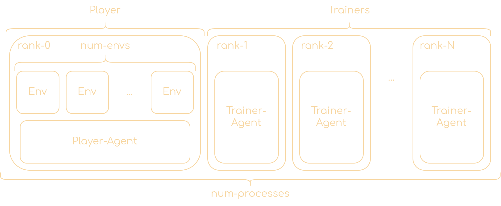

# ⚡ Sheep RL 🐑
An easy-to-use framework for reinforcement learning in PyTorch, accelerated with [Lightning Fabric](https://lightning.ai/docs/fabric/stable/).

## Why
We want to provide a framework for RL algorithms that is at the same time simple and scalable thanks to Lightning Fabric.

Moreover, in many RL repositories, the RL algorithm is tightly coupled with the environment, making it harder to extend them beyond the gym interface. We want to provide a framework that allows to easily decouple the RL algorithm from the environment, so that it can be used with any environment. 

## How to use
First, clone the repo with:

```bash
git clone https://github.com/Eclectic-Sheep/sheeprl.git
cd sheeprl
```

From inside the newly create folder run [Poetry](https://python-poetry.org) to install you preferred [PyTorch version](https://pytorch.org/get-started/locally/) (a version >=2.0 is required to properly run sheeprl):

```bash
poetry run pip install "torch>=2.0"
```


and then install the package and activate the newly created environment with:

```bash
poetry install
poetry shell
```

Now you can use one of the already available algorithms, or create your own. 

For example, to train a PPO agent on the CartPole environment, just run
```bash
python sheeprl.py ppo --env_id CartPole-v1
```

One can check all the available algorithms with
```bash
python sheeprl.py --sheeprl_help
```

That's all it takes to train an agent with Sheep RL! 🎉

### :chart_with_upwards_trend: Check your results

Once you trained an agent, a new folder called `logs` will be created, containing the logs of the training. You can visualize them with [TensorBoard](https://www.tensorflow.org/tensorboard):
```bash
tensorboard --logdir logs
```
https://github.com/Eclectic-Sheep/sheeprl/assets/7341604/46ad4acd-180d-449d-b46a-25b4a1f038d9

### :nerd_face: More about running an algorithm
What you run is the PPO algorithm with the default configuration. But you can also change the configuration by passing arguments to the script.

For example, in the default configuration, the number of parallel environments is 4. Let's try to change it to 8 by passing the `--num_envs` argument:
```bash
python sheeprl.py ppo --env_id CartPole-v1 --num_envs 8
```

All the available arguments, with their descriptions, are listed in the `args.py` file under the algorithm's folder or can be retrieved by passing `-h` argument:

```bash
sheeprl.py ppo -h
```

### Running with Lightning Fabric
To run the algorithm with Lightning Fabric, you need to call Lightning with its parameters. For example, to run the PPO algorithm with 4 parallel environments on 2 nodes, you can run:
```bash
lightning run model --accelerator=cpu --strategy=ddp --devices=2 sheeprl.py ppo --env_id CartPole-v1
```

You can check the available parameters for Lightning Fabric [here](https://lightning.ai/docs/fabric/stable/api/fabric_args.html).

## :book: Repository structure
The repository is structured as follows:

  * `algos`: contains the implementations of the algorithms. Each algorithm is in a separate folder, and (possibly) contains the following files:

    * `<algorithm>.py`: contains the implementation of the algorithm.
    * `<algorithm>_decoupled.py`: contains the implementation of the decoupled version of the algorithm, if present.
    * `agent`: optional, contains the implementation of the agent.
    * `args.py`: contains the arguments of the algorithm, with their default values and descriptions.
    * `loss.py`: contains the implementation of the loss functions of the algorithm.
    * `utils.py`: contains utility functions for the algorithm.

  * `data`: contains the implementation of the data buffers.
  * `envs`: contains the implementation of the environment wrappers.
  * `models`: contains the implementation of the some standard models (building blocks), like the multi-layer perceptron (MLP) or a simple convolutional network (NatureCNN)
  * `utils`: contains utility functions for the framework.

#### Coupled vs Decoupled
In the coupled version of an algorithm, the agent interacts with the environment and executes the training loop. 

<p align="center">
  
</p>

In the decoupled version, a process is responsible only for interacting with the environment, and all the other processes are responsible for executing the training loop. The two processes communicate through [collectives](https://lightning.ai/docs/fabric/stable/api/generated/lightning.fabric.plugins.collectives.TorchCollective.html#lightning.fabric.plugins.collectives.TorchCollective).

<p align="center">
  
</p>

#### Coupled
The algorithm is implemented in the `<algorithm>.py` file. 

There are 2 functions inside this script:

  * `main()`: initializes all the components of the algorithm, and executes the interactions with the environment. Once enough data is collected, the training loop is executed by calling the `train()` function.
  * `train()`: executes the training loop. It samples a batch of data from the buffer, compute the loss and updates the parameters of the agent.

#### Decoupled
The decoupled version of an algorithm is implemented in the `<algorithm>_decoupled.py` file.

There are 3 functions inside this script:

  * `main()`: initializes all the components of the algorithm, the collectives for the communication between the player and the trainers and calls the `player()` and `trainer()` functions.
  * `player()`: executes the interactions with the environment. It samples an action from the policy network, executes it in the environment, and stores the transition in the buffer. After a predefined number of iteractions with the environment, the player randomly splits the collected data in almost-equal chunks and send them separately to the trainers. It then waits for the trainers to finish the agent update.
  * `trainer()`: executes the training loop. It receives a chunk of data from the player, compute the loss and updates the parameters of the agent. After the agent has been updated, the first of the trainers sends back the updated agent weights to the player, which can interact again with the environment.

## Algorithms implementation
You can check inside the folder of each algorithm the `README.md` file for the details about the implementation.

All algorithms are kept as simple as possible, in a [CleanRL](https://github.com/vwxyzjn/cleanrl) fashion. But to allow for more flexibility and also more clarity, we tried to abstract away anything that is not strictly related with the training loop of the algorithm. 

For example, we decided to create a `models` folder with an already-made models that can be composed to create the model of the agent.

For each algorithm, losses are kept in a separate module, so that their implementation is clear and can be easily utilized also for the decoupled or the recurrent version of the algorithm.

## :card_index_dividers: Buffer
For the buffer implementation, we choose to use a wrapper around a [TensorDict](https://pytorch.org/rl/tensordict/reference/generated/tensordict.TensorDict.html).

TensorDict comes handy since we can easily add custom fields to the buffer as if we are working with dictionaries, but we can also easily perform operations on them as if we are working with tensors.

This flexibility makes it very simple to implement, with the single class `ReplayBuffer`, all the buffers needed for on-policy and off-policy algorithms.

### :mag: Technical details
The tensor's shape in the TensorDict are `(T, B, *)`, where `T` is the number of timesteps, `B` is the number of parallel environments, and `*` is the shape of the data.

For the `ReplayBuffer` to be used as a RolloutBuffer, the proper `buffer_size` must be specified. For example, for PPO, the `buffer_size` must be `T * B`, where `T` is the number of timesteps and `B` is the number of parallel environments.

## :bow: Contributing
The best way to contribute is by opening an issue to discuss a new feature or a bug, or by opening a PR to fix a bug or to add a new feature.
