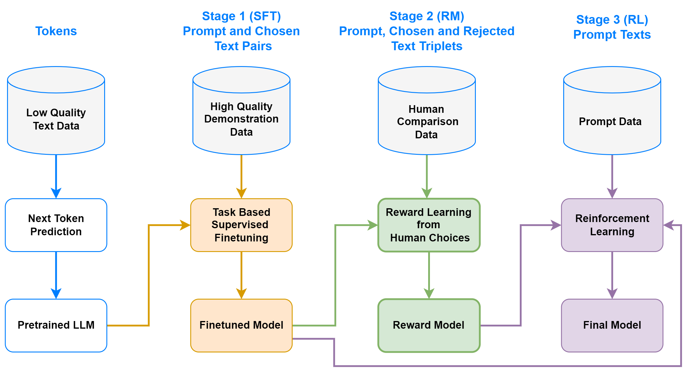

# Reinforcement Learning with Human Feedback

<p align="center">
  
</p>

Reinforcement Learning with Human Feedback (RLHF) is a technique that combines traditional reinforcement learning (RL) with human decisions to train more effective and safe policies. Instead of solely relying on reward signals obtained from the environment, RLHF integrates feedback from humans to guide the learning process. With RLHF, we can have approximated reward signals that are not crafted manually, but rather learned from human judgments.

In this algorithm section, we are using transformer based large language models from [transformers](https://github.com/huggingface/transformers) library and implement each different algorithm with using [fabric](https://lightning.ai/docs/fabric/stable/) and [torchmetrics](https://torchmetrics.readthedocs.io/en/stable/).

> **Note**
>
> This algorithm section of SheepRL requires optional dependencies for RLHF. To install all the optional dependencies one can run `pip install .[rlhf]`.

## Details

- Every experiment script creates its own folder and saves all the checkpoints, logs, and metrics to that folder. All used arguments are saved as `args.json` file.
- All parameters that can be passed to each script can be found in `sheeprl/algos/rlhf/args.py` file with explanations.
- All the scripts can be run with `--help` flag to see all the available arguments and their explanations.
- Datasets provided in this repository might not be the original ones with correct train/validation/test splits. They are provided for quick experimenting.
- Example scripts uses relatively small LLMs for training and finetuning. The user can change the model by passing `--model_name_or_path` argument to the script. The model name should be one of the models available in [transformers](https://github.com/huggingface/transformers) library.
- According to the GPU capacity, the user can change the batch size and activate gradient accumulation. For example: `--mini_batch_size=4 --micro_batch_size=2` will result in 2 samples per device and 2 gradient accumulation steps per device. The total batch size will be 4 samples per device.


## Datasets

We have already prepared dataset processing scripts for common RLHF datasets. Each dataset has its own folder with unique name. each folder contains `prepare_data.py` script that will download the dataset and process it into a format and save it to disk. Preprocessing relies on models and tokenizers used by selected model. Each time you change the model, you need to reprocess the dataset. Two examples of datasets are provided also contains `demo.py` file which you can load your trained model and interact with it using interface developed with [Gradio](https://www.gradio.app/)

> **Note**
>
> Example datasets are not included in the repository. You can download them using `prepare_data.py` scripts in each dataset folder. They might not contain all available data source from original authors. They are added for quick experimenting and testing the algorithms. Anyone can add new datasets to the repository by following the similar structure.


### Helpful - Harmless

This dataset contains human-assistant dialogue samples for training a helpful and harmless agents. The dataset contains chosen and rejected pairs. Chosen pairs are the ones that are considered helpful and harmless by human annotators. Rejected pairs are the ones that are considered harmful or not helpful by human annotators. Here is an example script to download and process the dataset.

```bash
sheeprl/algos/rlhf/helpful_harmless/prepare_data.py \
    --destination_dir=data/rlhf-helpful_harmless/mini-opt \
    --tokenizer_name=facebook/opt-350m \
    --max_length=256 \ # 128 for question + 128 for answer
    --max_prompt_length=128 \
    --remove_same_inputs=True \
    --remove_same_responses=True \
    --shuffle=True \
    --validation_percentage=0.1 \
    --stage=finetune # or --stage=preference 
```

The dialog can have two or more turns that always ends with assistant's response. Each turn has its own identifier as `Human:` and `Assistant:`. 

### Summarization

For summarization task, we are using [CarperAI/openai_summarize_comparisons](https://huggingface.co/datasets/CarperAI/openai_summarize_comparisons). This dataset is cleaned and prepared version of original OpenAI summarization dataset. Here is an example script to download and process the dataset.

```bash
sheeprl/algos/rlhf/summarization/prepare_data.py \
    --destination_dir=data/rlhf-summarization/mini-opt \
    --tokenizer_name=facebook/opt-350m \
    --max_length=384 \  # 256 for prompt + 128 for response
    --max_prompt_length=256 \
    --remove_same_inputs=False \ # some samples has same input but different responses
    --remove_same_responses=True \
    --shuffle=True \
    --validation_percentage=0.1 \
    --stage=finetune # or --stage=preference 
```

### Bring your own dataset

The user can implement their own dataset processing script by following the structure of the existing ones. The script should be named as `prepare_data.py` and should be placed in a folder with unique name. The script should create following files in the destination directory:

- `finetune_(train/validation/test).pt`: List of dictionaries with keys `prompt_len`, `input_ids` and `targets` with masked indexes.
- `preference_(train/validation/test).pt`: List of dictionaries with keys `prompt_len`, `chosen_input_ids`, `rejected_input_ids`
- `args.json`: Arguments used for processing the dataset.
- `example_prompt.pt`: single dictionary with keys `prompt` for text, `input_ids` for tokenized input, `attention_mask` for attention mask. This example is not from dataset but created for the user to test their trained model.

## Supervised Finetuning (SFT)

SFT is a supervised learning approach to train a language model to learn generating similar responses given prompts in the dataset. The model is trained with cross entropy loss. The user can decide using only response part or all input to compute the loss. The loss function is :

$$
\begin{equation}
\mathcal{L}(\text{outputs}, \text{targets}) = \text{CrossEntropy}\left( \text{outputs}_{...,:-1,:}, \text{targets}_{...,1:} \right)
\end{equation}
$$

$$
\begin{equation}
\text{CrossEntropy}(y, t) = - \sum_{i} t_i \log(y_i)
\end{equation}
$$

Example Script for running SFT:
    
```bash
sheeprl/algos/rlhf/rlhf_sft.py \
    --data_dir=data/rlhf-helpful_harmless/mini-opt \
    --model_name=facebook/opt-350m \
    --learning_rate=1e-5 \
    --epochs=1 \
    --lr_warmup_steps=200 \
    --micro_batch_size=8 \
    --mini_batch_size=8 \
    --save_interval=1000 \
    --eval_iters=100 \
    --disable_dropout=False \
    --finetune_mode=all \
    --use_targets=False
```


## Reward Modeling (RM)

Reward modeling method learns a reward function from human choices. The model compares `chosen` and `rejected` responses given the same prompt and learns to predict which one is more likely to be chosen by human. The loss computed as follows:

$$
\mathcal{L}(\text{RM})=\log \sigma\left(r\left(x, y_{chosen}\right)-r\left(x, y_{rejected}\right)\right)
$$

Example Script for running RM:
    
```bash
sheeprl/algos/rlhf/rlhf_rm.py \
    --data_dir=data/rlhf-helpful_harmless/mini-opt \
    --model_name=facebook/opt-350m \
    --learning_rate=1e-5 \
    --loss_type=per_sample \
    --epochs=1 \
    --lr_warmup_steps=200 \
    --micro_batch_size=8 \
    --mini_batch_size=8 \
    --save_interval=1000 \
    --eval_iters=100 \
    --disable_dropout=False \
    --finetune_mode=all
```

## Reinforcement Learning (RL/PPO)

Last stage of RLHF is reinforcement learning. The model is trained with Proximal Policy Optimization (PPO) algorithm. The reward signal is approximated with RM model. The loss function has two parts, actor and critic loss. Here are general equations for PPO:

$$
\mathcal{L}_{\text {ppo-clip }}(\theta)=\hat{\mathbb{E}}_t\left[\min \left(\frac{\pi_\theta\left(a_t \mid s_t\right)}{\pi_{\theta_{\text {old }}}\left(a_t \mid s_t\right)} \hat{A}_t, \operatorname{clip}\left(\frac{\pi_\theta\left(a_t \mid s_t\right)}{\pi_{\theta_{\text {old }}}\left(a_t \mid s_t\right)}, 1-\epsilon, 1+\epsilon\right) \hat{A}_t\right)\right]
$$

$$
\mathcal{L}_{\text {critic }}(\phi)=\hat{\mathbb{E}}_t\left[\left\|V_\phi\left(s_t\right)-\hat{R}_t\right\|^2\right]
$$

Addition to the general PPO algorithm, reward signal is penalized with KL-divergence between reference model and actor model outputs. This is to prevent the model to diverge from the reference model. The reference model is the model that is finetuned with SFT method. The reward computed as follows:

$$
r_{\text {total }}=r(x, y)-\eta \mathrm{KL}\left(\pi_\phi^{\mathrm{Actor}}(y \mid x), \pi^{\mathrm{Ref}}(y \mid x)\right)
$$

Example Script for running PPO:
    
```bash
sheeprl/algos/rlhf/rlhf_ppo.py \
    --data_dir=data/rlhf-helpful_harmless/mini-opt \
    --model_name=facebook/opt-350m \
    --epochs=1 \
    --micro_batch_size=4 \
    --mini_batch_size=8 \
    --rollout_size=16 \
    --rollout_mini_batch_size=4 \
    --save_interval=500 \
    --eval_interval=50 \
    --eval_iters=100 \
    --disable_dropout=True \ # disabling dropout stabilizes the training
    --finetune_mode=all \
    --sft_experiment_dir=<sft-dir> # replace with your SFT experiment dir
    --rm_experiment_dir=<rm-dir> # replace with your RM experiment dir
    --actor_learning_rate=1e-6 \
    --critic_learning_rate=1e-6 \
    --ppo_epochs=1 \
    --init_kl_coeff=0.02
```

## Acknowledgements

This work and the code developed for the task is a long educational and experimental journey. We would like to thank the following works for their contributions to the field and inspiring us to develop this work.

### Libraries

- [TRL](https://github.com/lvwerra/trl)
- [DeepSpeedChat](https://github.com/microsoft/DeepSpeedExamples/blob/master/applications/DeepSpeed-Chat/README.md)
- [TRLX](https://github.com/CarperAI/trlx)
- [Lit-Llama](https://github.com/Lightning-AI/lit-llama)
- [Lit-GPT](https://github.com/Lightning-AI/lit-gpt)
- [MinLora](https://github.com/cccntu/minlora)

### Blog Posts

- [StackLLaMa](https://huggingface.co/blog/stackllama)
- [Implementing RLHF: Learning to Summarize with trlX](https://wandb.ai/carperai/summarize_RLHF/reports/Implementing-RLHF-Learning-to-Summarize-with-trlX--VmlldzozMzAwODM2)
- [RLHF: Reinforcement Learning from Human Feedback](https://huyenchip.com/2023/05/02/rlhf.html)

### Research Articles

- [Learning to summarize from human feedback](https://arxiv.org/abs/2009.01325)
- [Training language models to follow instructions](https://arxiv.org/abs/2203.02155)
- [DeepSpeed-Chat: Easy, Fast and Affordable RLHF Training of ChatGPT-like Models at All Scales](https://arxiv.org/abs/2308.01320)
- [Secrets of RLHF in Large Language Models Part I: PPO](https://arxiv.org/abs/2307.04964)
- [LLAMA 2: Open Foundation and Fine-Tuned Chat Models](https://arxiv.org/abs/2307.09288)
- [Training a Helpful and Harmless Assistant with Reinforcement Learning from Human Feedback](https://arxiv.org/abs/2204.05862)